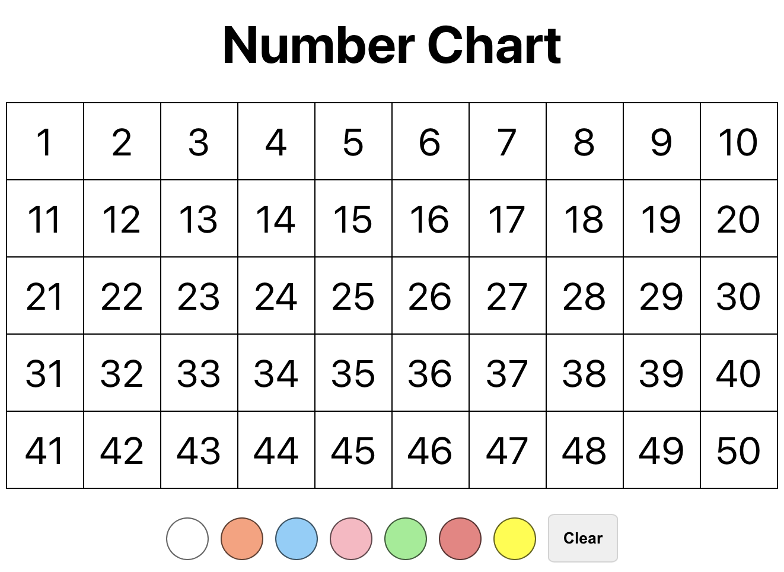

# Number Chart

This project was bootstrapped with [Create React App](https://github.com/facebook/create-react-app).

## Project Details

A single page react app that utilizes the useState hook to manage the state of an interactive number chart. Select the size (1-20, 1-50, or 1-100) and a color to illustrate patterns. Additionally, use the 'multiples' buttons to reveal the multiples of 2, 5, or 10.

## To run the project:

1. Clone this repo
2. Run `npm install`
3. Run `npm start`

### Learn More

You can learn more in the [Create React App documentation](https://facebook.github.io/create-react-app/docs/getting-started).

To learn React, check out the [React documentation](https://reactjs.org/).
